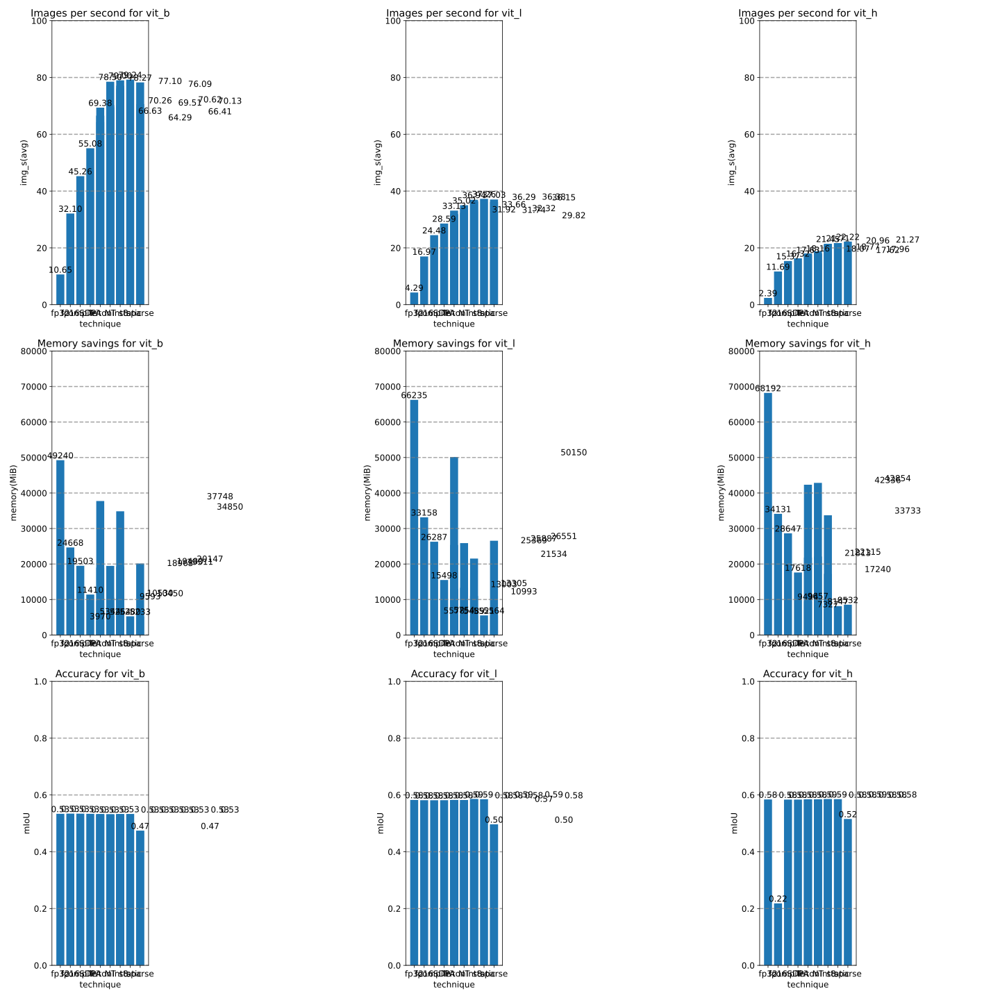

# Segment anything ... Fast

## Dependencies

PyTorch branch: https://github.com/pytorch/pytorch

SegmentAnything fork: https://github.com/cpuhrsch/segment-anything

## Results

The results show a waterfall of techniques.

Left to right these techniques are combined.

That means the very last bar is the combination of
- bfloat16
- torch.compile with max-autotune
- [torch.scaled_dot_product_attention](https://pytorch.org/docs/main/generated/torch.nn.functional.scaled_dot_product_attention.html)
- A custom Triton kernel that implements SDPA for relative positional encodings for long sequence lengths
- NestedTensors
- Dynamic int8 symmetric quantization
- 2:4 sparse format

These experiments were run with batch size 20.

