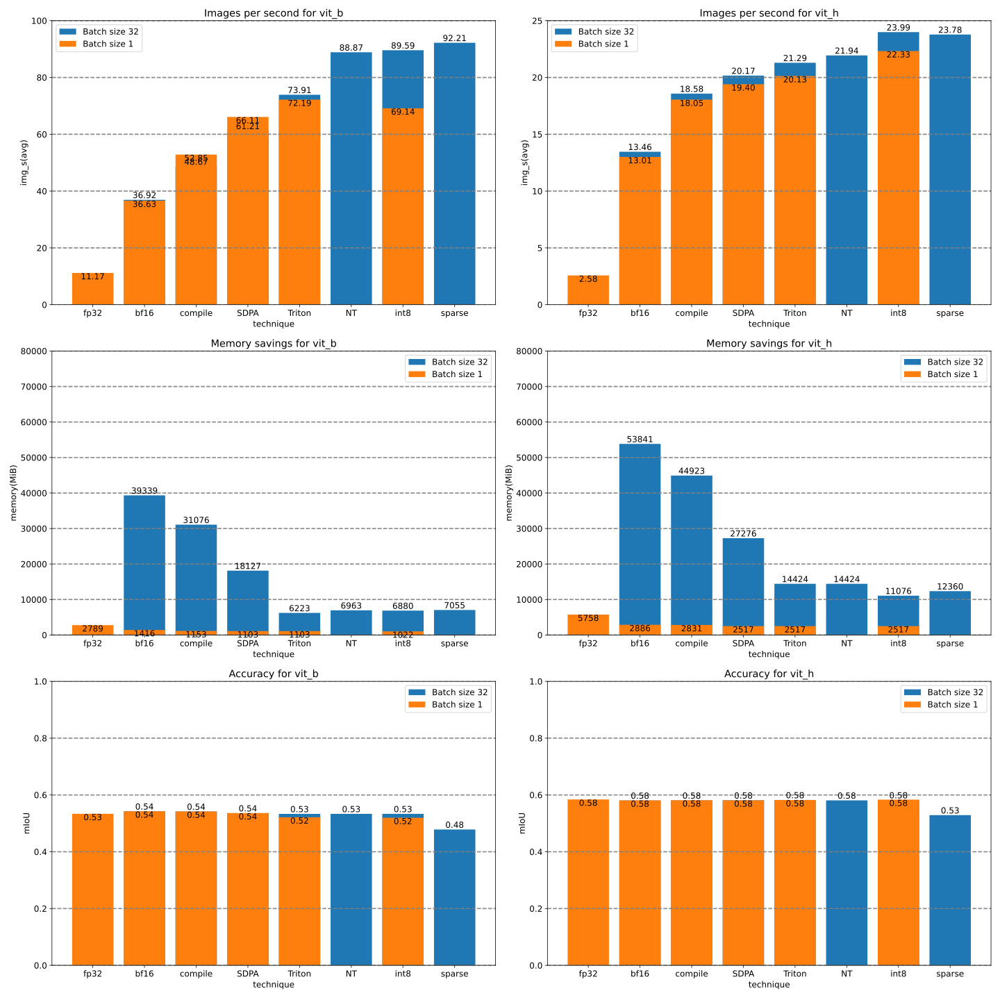

# Segment anything ... Fast

This work is based on a fork of https://github.com/facebookresearch/segment-anything


## Dependencies

Latest PyTorch nightly


For example:
```
pip3 install --pre torch torchvision torchaudio --index-url https://download.pytorch.org/whl/nightly/cu121
```

Installation instructions vary by platform. Please see the website https://pytorch.org/

## Results

The results show a waterfall of techniques.

Left to right these techniques are combined.

That means the very last bar is the combination of
- bfloat16
- torch.compile with max-autotune
- [torch.scaled_dot_product_attention](https://pytorch.org/docs/main/generated/torch.nn.functional.scaled_dot_product_attention.html)
- A custom Triton kernel that implements SDPA for relative positional encodings for long sequence lengths
- NestedTensors
- Dynamic int8 symmetric quantization
- 2:4 sparse format



## License

`segment-anything-fast` is released under the [Apache 2.0](https://github.com/pytorch-labs/segment-anything-fast/main/LICENSE) license.
